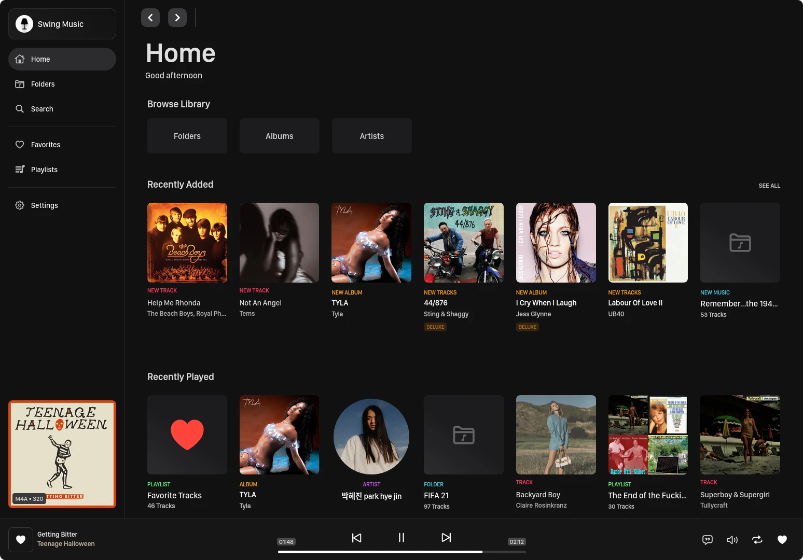
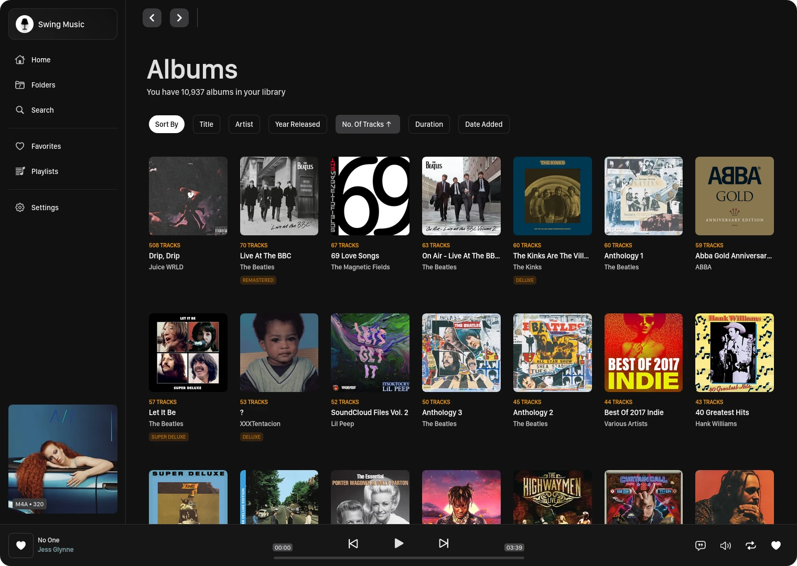

*
The new homepage
*

## 

This release features a lot of enhancements and bug fixes, together with some really cool features. AKA. a homepage! Most of the enhancements you won't be able to see it, but hopefully, you will feel it.

# What's new?

- A homepage showing recently added and played items
- Pages to browse your library by artists and albums. You can sort by properties like duration, track count, added date.
- Recently added items on homepage
- Recently played items on homepage
- Add Google, YouTube, Wikipedia and Last.fm to artist and album search
- Artist discography and favorites pages.
- This version will start tracking your listening activity. Basically what you listen to and how long.

## BUG FIXES & IMPROVEMENTS

- Artist discography page redesign to make it more intuitive
- Incorrect last updated time on playlist page
- Removed scrolling on horizontal card lists
- Increase spacing in compact and wide screen mode
- Fix duplicate requests in album and artist page
- More UI consistency across pagest
- Artists, albums and playlist duration calculated incorrectly for hours > 24\
- Add infinite scroll to search page to remove the big blue load more button
- Change settings text for (hopefully ...) simplicity
- Default to no sidebar (I think it looks better that way!). You can

Enjoy!

*
The browse albums page
*