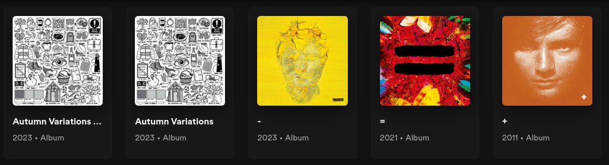

# Hashing

I didn't know what else to name this page, so I just named it hashing.

## What is hashing in this context?

From sources on the web, "hashing is the process of converting data — text, numbers, files, or anything, really — into a fixed-length string of letters and numbers". In our little case here, we would modify that to say something like: "hashing is the process of creating a short identifier (hash) for tracks, artists and albums".

We need a short hash because we want to perform searches faster while keeping URLs short. For the unique part, a special condition is added into the mix: the ability to return the same hash for soft duplicates (case-insensitive and non-alpha numeric character ignoring). For example, given the hash for artist name "Bob" is `foobar`, the other variation of it (eg. "bob", "BoB", "bob?") should give the same hash `foobar`.

This hashing method makes one costly assumption: Any non-alphanumeric characters are for decoration and can be done without. This of course is messed up, but it works for 99% of the tracks, albums and artists. The remaining 1% is the cost of doing business (standardization).

## Why do we need this?

These are a few use cases that I can remember without digging through the code.

### 1. Duplicate detection

First of all, when we refer to songs as duplicates, it means that regardless of the file quality, filepath or anything else, those songs share the same track title, album and artist despite the text case. This is how we treat tracks in the real world. Right?

When showing an album with duplicates, we filter out duplicates and show trackswith the highest bitrate, keeping your album page clean.

### 2. Downloading images from the internet

Swing Music uses Deezer as the artist image provider. When searching for artist images, the first result is not always the correct artist. Therefore, we use hashing to get the correct artist image from the list of results.

For this specific task, we also consider decoding artist names for special characters. (eg. `Chlöe` and `Chloe` are the same artist). The `unidecode` library is used for decoding.

## The steps

The structure of the hash function looks something like this:

```py
def create_hash(*args: str):
    # steps here
    return created_hash
```

The `args` are an arbitrary number of string to use to create a hash. For example, when creating a track hash (track identifier) you pass it the track title, artist and album in that order.

```py
create_hash('Speedometer', 'Post Malone', 'AUSTIN')
```

The hash function follows the following steps when creating the hash:

1. Removes non-alphanumeric characters from the args separately
2. joining them in that order and converting to lowercase
3. generating a `sha1` hash of the resulting string
4. selecting 10 chars from the hash (concatenation of the first 5 and last 5 chars)

## Caveats

Ed Sheran!!!

This guy sums all the problems that could arise with our hashing thing. Have you ever checked out his discography? Look at the image below.



Notice the last 3 albums in the image? Their titles are non-alphanumeric characters. This means that once they follow our little procedure up there, they'll all have the same album hash. Thus, they'll all appear in the same album.

I experienced this sometime back and I fixed by using an if statement that states something like this: if you strip an `arg` and get an empty string hash it as is.

```py
create_hash('Drunk', 'Ed Sheeran', '=')
                                 # 👆 leave this one alone
```

Scenarios like these outside Ed Sheeran are rare, but not non-existent.

Here's another one:


These 2 totally different albums will have the same hash because the plus sign on the 2nd album will be stripped.

If you can help fix this, a pull request is more than welcome. The hashing logic is contained in the `app/utils/hashing.py` file.