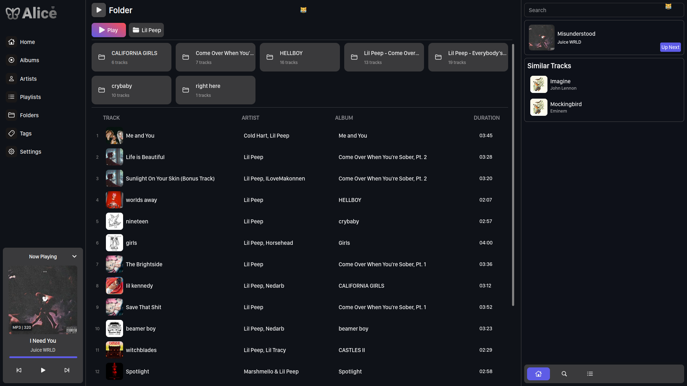
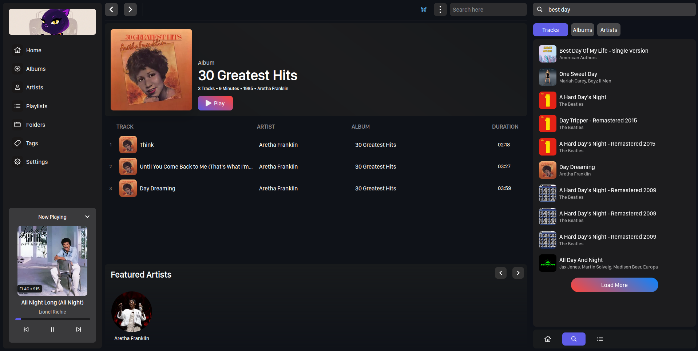
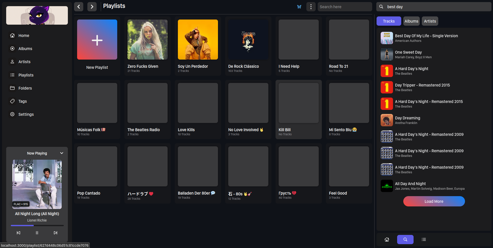
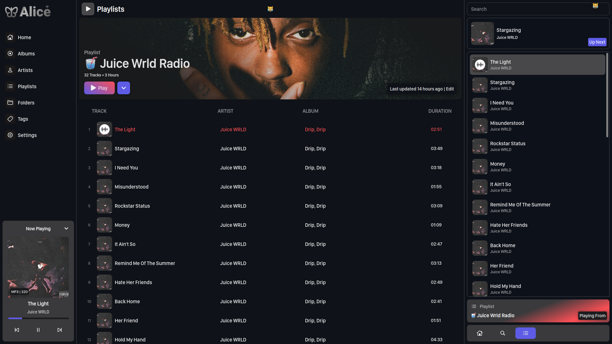

### Alice Music

Alice is a web-based music manager (or basically a music player) that will make it easier to find and enjoy your music. Currently in the early stages of development.

Although it's quite usable, it's not quite ready for use yet. I'm working on getting done with some dev setup instructions. So, check back soon!

Assuming you won't look at those broken buttons twice, here are some screenshots of the current state of the app:

### 1. The folder page

This pages allows you to navigate through your music folders the same way you would on your computer. It doesn't show the directories without playable files. At this point, only FLAC and MP3 files are supported. (For experimenting purposes only, other formats will be added before the stable release)

### 2. The Album page

This page shows the album details including tracks, album artist, featured artists and Last FM album bio. The UI may look a bit rough but it will do for now.

### 3. The Playlists list page

This page lists all the playlists you have created. More features will be added to this page in the future. These "might" include Folders, Search, etc.

### 4. The Playlist page

This page shows the details of the playlist. It includes the playlist name, description, and the songs in the playlist. You can update your playlist details from this page.

### A little narration

The app features two sidebars. The one on the left and one on the right. The left sidebar is the classic navigation bar while the right sidebar acts as a quick access menu. The queue and the global search components are fixed here. Although they might switch to other locations in the future, the current position will work for now.

Here are some other functional features already implemented:

- Track context menu
- Global search (😅 buggy as fuck)
- Basic playback controls
- Queue saving on browser or page reload.

There may be a few more, but I can't remember them at the moment.

### Dev Setup

I'm working on this section. I'll be adding instructions soon. Please check back later!

  
<b>🔥🔥🔥 Version 0.1.0-alpha is coming soon 🔥🔥🔥</b>

I've been working on this for a while and I'm happy to announce that version 0.1 alpha is almost ready.

Here are some of the features that will be working:

1. Browsing and playing music from your folders
2. Creating playlists
3. Viewing album page
4. Adding single tracks to queue
5. Adding tracks to playlist
6. Customizing playlist, etc

I'm testing this out on my Ubuntu machine. If you have Windows, Mac or FreeBSD, you might run into some issues.

⏩️⏩️⏩️⏩️⏩️

### Contributing

The app runs on Python, Vue, Flask, and MongoDB. If you want to contribute, please open an issue or pull request. Your contribution is highly valued.
