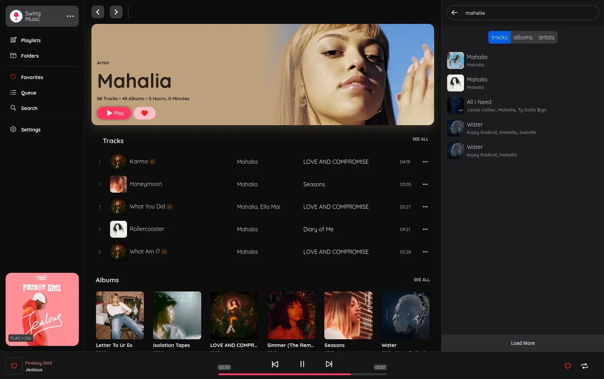
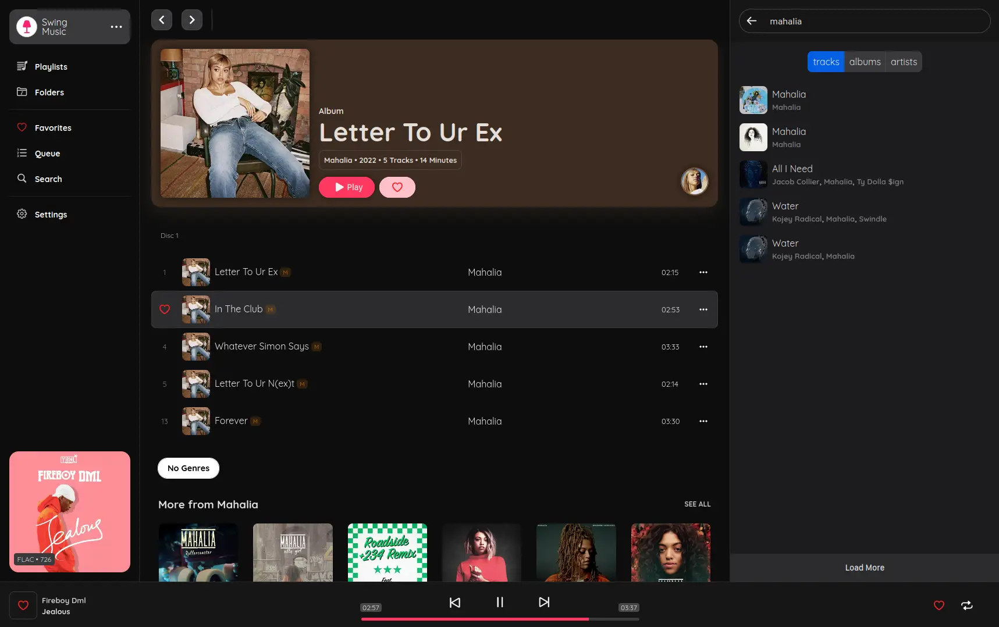
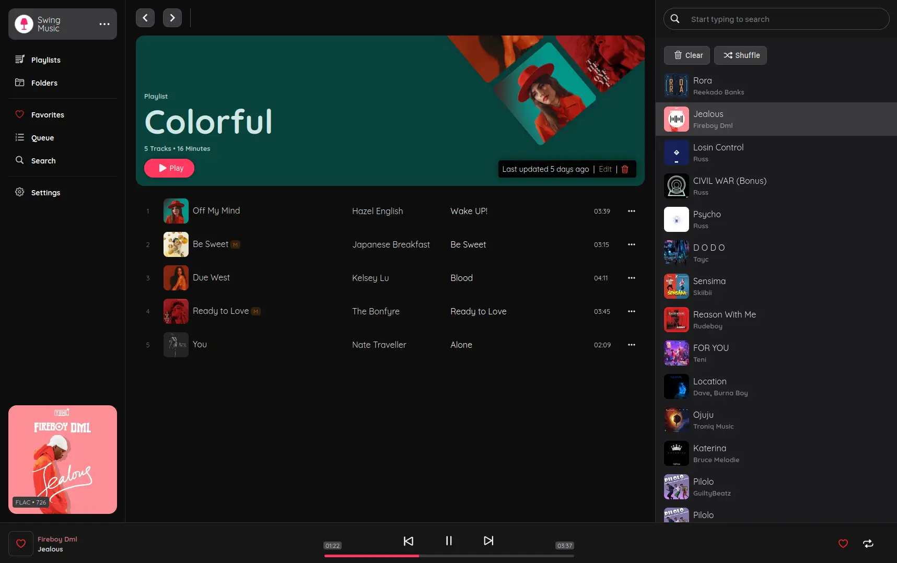

# Swing music







---

### Make listening to your local music fun again.

`Swing` is a music player for local audio files built with both visual coolness and functionality in mind. Just run the app and enjoy your music library in a web browser.

### For screenshots, see the [screenshots page on the website](https://swingmusic.vercel.app/screenshots.html).

> Note: This project is in the early stages of development. Many features are missing but will be added with time.

### Setup

Download the latest release from the [release page](https://github.com/geoffrey45/swingmusic/releases) and launch it. For Linux, you need to make the file executable first.

```bash
chmod a+x ./swingmusic

./swingmusic
```

The app should start at <http://localhost:1970> by default.

```
Usage: swingmusic [options]

Options:
    --build: Build the application (in development)
    --host: Set the host
    --port: Set the port

    --show-feat, -sf: Do not extract featured artists from the song title
    --show-prod, -sp: Do not hide producers in the song title

    --help, -h: Show this help message
    --version, -v: Show the app version
```

To stream your music across your local network, use the `--host` flag to run the app in all ports. Like this:

```sh
swingmusic --host 0.0.0.0
```

The link to access the app will be printed on your terminal. Copy it and open it in your browser.

### Docker

You can run Swing in a Docker container. To do so, clone the repository and build the image:

    git clone https://github.com/swing-opensource/swingmusic.git --depth 1
    cd swingmusic
    docker build . -t swingmusic

Then create the container. Here are some example snippets to help you get started creating a container.

#### docker-compose

```yaml
---
version: "3.8"
services:
  swing:
    image: swingmusic
    container_name: swingmusic
    volumes:
      - /path/to/music:/music
      - /path/to/config:/config
    ports:
      - 1970:1970
    restart: unless-stopped
```

#### docker cli

```bash
docker run -d \
  --name=swingmusic \
  -p 1970:1970 \
  -v /path/to/music:/music \
  -v /path/to/config:/config \
  --restart unless-stopped \
  swingmusic
```

#### Parameters

Container images are configured using parameters passed at runtime (such as those above). These parameters are separated by a colon and indicate `<external>:<internal>` respectively. For example, `-p 8080:80` would expose port `80` from inside the container to be accessible from the host's IP on port `8080` outside the container.

| Parameter | Function |
| :----: | --- |
| `-p 1970` | WebUI |
| `-v /music` | Recommended directory to store your music collection. You can bind other folder if you wish. |
| `-v /config` | Configuration files. |

### Development

This project is broken down into 2. The client and the server. The client comprises of the user interface code. This part is written in Typescript, Vue 3 and SCSS. To setup the client, checkout the [swing client repo ](https://github.com/geoffrey45/swing-client) on GitHub.

The second part of this project is the server. This is the main part of the app that runs on your machine, interacts with audio files and send data to the client. It's written in Python 3.

The following instructions will guide you on how to setup the **server**.

---

The project uses [Python poetry](https://python-poetry.org) as the virtual environment manager. Follow the instructions in [their docs](https://python-poetry.org/docs/) to install it in your machine.

> It is assumed that you have `Python 3.10` or newer installed in your machine. This project uses type hinting features so older version of Python will not work. If you don't have Python installed in your machine, get it from the [python website](https://www.python.org/downloads/).

Clone this repo locally in your machine. Then install the project dependencies and start the app.

```sh
git clone https://github.com/geoffrey45/swingmusic.git

cd swingmusic

# install dependencies using poetry
poetry install

# start the app
poetry run python manage.py
```

### Contributing

If you want to contribute to this project, feel free to open an issue or a pull request on Github. Your contributions are highly valued and appreciated. Feature suggestions, bug reports and code contribution are welcome.

### License

This software is provided to you with terms stated in the MIT License. Read the full text in the `LICENSE` file located at the root of this repository.

---

### A brain dump ...

I started working on this project on dec 2021. Why? I like listening and exploring music and I like it more when I can enjoy it (like really really). I'd been searching for cute music players for linux that allow me to manage my ever growing music library. Some of the main features I was looking for were:

- A simple and beautiful user interface (main reason)
- Creating automated daily mixes based on my listening activity.
- Ability to move files around without breaking my playlists and mixes.
- Something that can bring together all the audio files scattered all over my disks into a single place.
- Browsing related artists and albums.
- Reading albums & artists biographies and getting insights on song lyrics (kinda Genium.com-ish).
- Web browser based user interface.
- a lot more ... but I can't remember them at the moment

I've been working to make sure that most (if not all) of the features listed above are built. Some of them are done, but most are not even touched yet. A lot of work is needed and I know that it will take a lot of time to build and perfect them.

I've been keeping a small 🤥 list of a few cool features that I'd like to build in future. Some of the features listed there are outright stupid but some are cool. You can check it out in [this notion page](https://rhetorical-othnielia-565.notion.site/Cool-features-1a0cd5b797904da687bec441e7c7aa19).

I have been working on this project solo, so it’s very hard to push things fast. If you have programming knowledge in Python or Vue, feel free to contribute to the project. Your contributions are highly appreciated.

---

**[MIT License](https://opensource.org/licenses/MIT) | Copyright (c) 2023 Mungai Njoroge**
