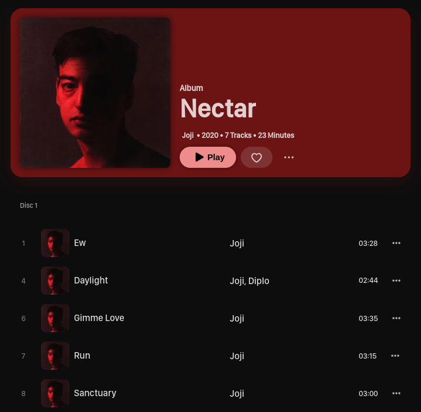
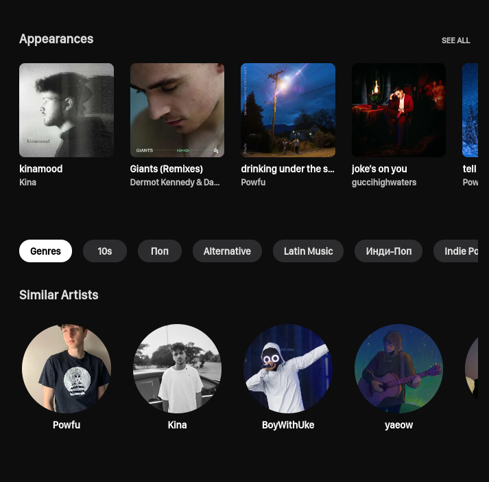
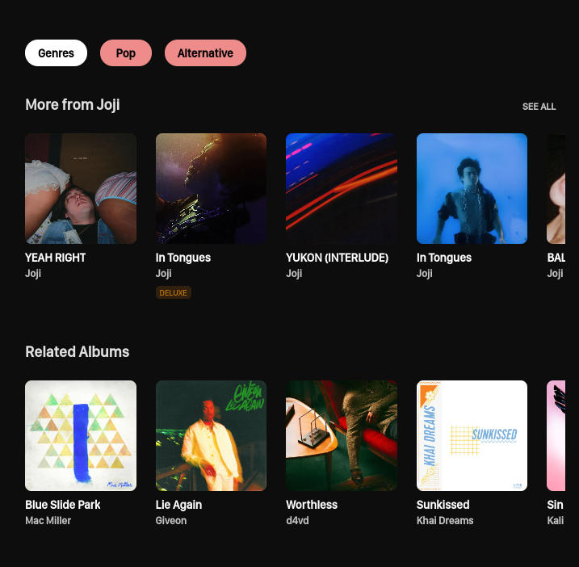

# Swing music (v1.3.0 releasing soon!)

Swing Music is a beautiful, self-hosted music player for your local audio files. Like a cooler Spotify ... but bring your own music. Just run the app and enjoy your music library in a web browser.

<a href="https://swingmusic.vercel.app/support-us.html" target="_blank"></a>

|   |   |
| ------------------------------------------------------------ | ----------------------------------------------------------- |
|  |  |

For full size screenshots, visit the [website](https://swingmusic.vercel.app).

### Setup

Swing Music is available as pre-compiled binaries for Windows and Linux. Just download the latest release from
the [release page](https://github.com/geoffrey45/swingmusic/releases) and launch it.
For Linux, you need to make the file executable first.

```bash
chmod a+x ./swingmusic

./swingmusic
```

The app should start at <http://localhost:1970> by default. You can change the default port or host by using
the `--host` and `--port` flags.

```
Usage: swingmusic [options]
```

### Options

| Option               | Short  | Description                                                                   |
| -------------------- | ------ | ----------------------------------------------------------------------------- |
| `--help`             | `-h`   | Show help message                                                             |
| `--version`          | `-v`   | Show the app version                                                          |
| `--host`             |        | Set the host                                                                  |
| `--port`             |        | Set the port                                                                  |
| `--config`           |        | Set the config path                                                           |
| `--no-periodic-scan` | `-nps` | Disable periodic scan                                                         |
| `--scan-interval`    | `-psi` | Set the periodic scan interval in seconds. Default is 300 seconds (5 minutes) |
| `--build`            |        | Build the application (in development)                                        |

To stream your music across your local network, use the `--host` flag to run the app in all ports. Like this:

```sh
swingmusic --host 0.0.0.0
```

The link to access the app will be printed on your terminal. Open it in your browser to use Swing Music.

[Browse Docs](https://swingmusic.vercel.app)

### Docker

Pull the latest Docker image and run it:

```sh
docker pull ghcr.io/swing-opensource/swingmusic:v1.3.0
```

```sh
docker run --name swingmusic -p 1970:1970 \
  -v /path/to/music:/music \
  -v /path/to/config:/config \
  --restart unless-stopped \
  ghcr.io/swing-opensource/swingmusic:latest
```

Don't forget to replace `/path/to/music` and `/path/to/config` with the appropriate values. In addition, specify the the `/music` directory as the root directory. Using the `Home Directory` option won't work.

For more info, see the [Docker section](https://swingmusic.vercel.app/guide/getting-started.html#docker) on the docs.

#### Using Docker Compose

Here's a sample Docker compose file:

```yaml
---
version: "3.8"
services:
  swingmusic:
    image: swingmusic
    container_name: swingmusic
    volumes:
      - /path/to/music:/music
      - /path/to/config:/config
    ports:
      - "1970:1970"
    restart: unless-stopped
```

### Contributing

See [contributing guidelines](.github/contributing.md).

### License

This software is provided to you with terms stated in the MIT License. Read the full text in the `LICENSE` file located at the root of this repository.

**[MIT License](https://opensource.org/licenses/MIT) | Copyright (c) 2023 Mungai Njoroge**
