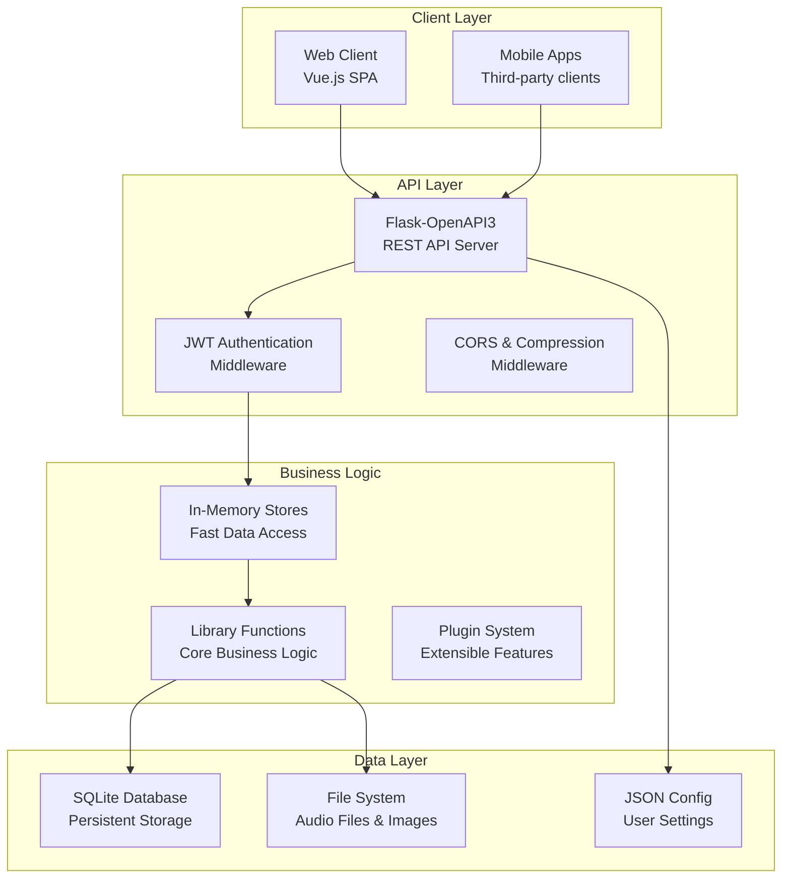
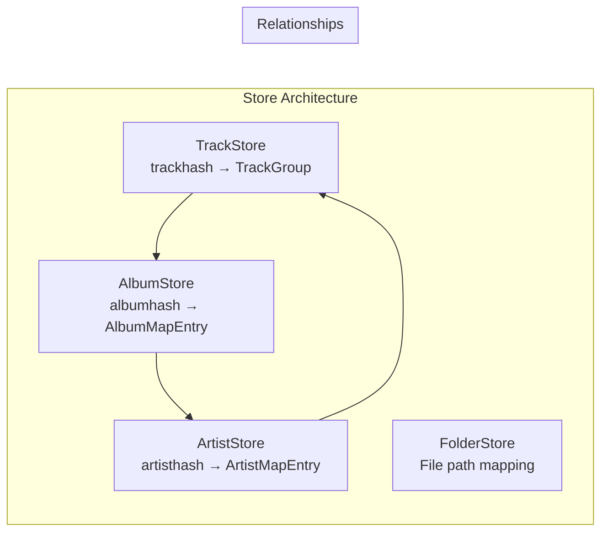
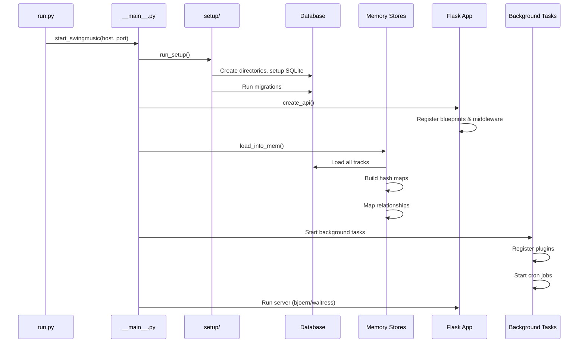
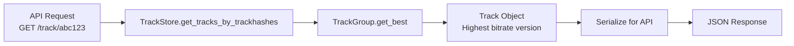
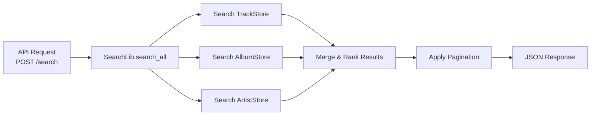
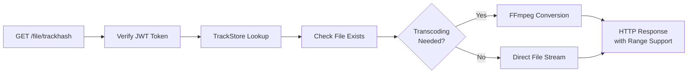
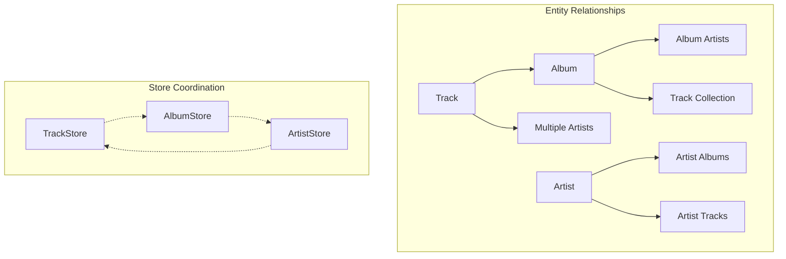

# SwingMusic Project Structure and Architecture

This document provides a comprehensive overview of how SwingMusic is structured, how its components interact, and the application lifecycle from startup to ready state.

> [!IMPORTANT]
> Disclaimer: This document was drafted with the help of an LLM. Last updated on July 14th, 2025.

## Project Overview

SwingMusic is a modern music streaming server built with Python (Flask) on the backend and Vue.js on the frontend. It provides a self-hosted music library management system with features like audio streaming, playlist management, favorite tracking, and metadata extraction.

## High-Level Architecture



## Directory Structure

```sh
swingmusic/
├── client/                   # Built Vue.js frontend (static files)
├── swingmusic/               # Main Python package
│   ├── __main__.py           # CLI entry point
│   ├── api/                  # REST API endpoints
│   │   ├── __init__.py       # Flask app creation & blueprint registration
│   │   ├── album.py          # Album-related endpoints
│   │   ├── artist.py         # Artist-related endpoints
│   │   ├── auth.py           # Authentication & user management
│   │   ├── stream.py         # Audio streaming & transcoding
│   │   ├── search.py         # Search functionality
│   │   ├── playlist.py       # Playlist management
│   │   ├── settings.py       # Configuration endpoints
│   │   └── ...               # Other API modules
│   ├── models/               # Data models (dataclasses)
│   │   ├── album.py          # Album model with type detection
│   │   ├── artist.py         # Artist model with image handling
│   │   ├── track.py          # Track model with metadata processing
│   │   ├── playlist.py       # Playlist model
│   │   └── user.py           # User model
│   ├── store/                # In-memory data stores
│   │   ├── albums.py         # Album store with hash-based lookup
│   │   ├── artists.py        # Artist store with relationship mapping
│   │   ├── tracks.py         # Track store with grouping by hash
│   │   └── folder.py         # Folder structure store
│   ├── db/                   # Database layer
│   │   ├── engine.py         # SQLAlchemy engine & session management
│   │   ├── libdata.py        # Library data tables (tracks, albums, etc.)
│   │   ├── userdata.py       # User data tables (favorites, playlists)
│   │   └── sqlite/           # SQLite-specific utilities & migrations
│   ├── lib/                  # Core business logic
│   │   ├── populate.py       # Media scanning & indexing
│   │   ├── trackslib.py      # Track processing utilities
│   │   ├── albumslib.py      # Album processing utilities
│   │   ├── artistlib.py      # Artist processing utilities
│   │   ├── searchlib.py      # Search algorithms
│   │   ├── tagger.py         # Metadata extraction & processing
│   │   └── transcoder.py     # Audio format conversion
│   ├── utils/                # Utility functions
│   │   ├── hashing.py        # Hash generation for entities
│   │   ├── auth.py           # Authentication utilities
│   │   ├── parsers.py        # Text parsing (artists, titles, etc.)
│   │   └── ...               # Other utilities
│   ├── plugins/              # Plugin system
│   │   ├── lyrics.py         # Lyrics fetching
│   │   ├── mixes.py          # Auto-generated playlists
│   │   └── lastfm.py         # Last.fm integration
│   ├── crons/                # Background tasks
│   │   ├── cron.py           # Cron job scheduler
│   │   └── mixes.py          # Automated playlist generation
│   ├── config.py             # Configuration management
│   ├── settings.py           # Path and system settings
│   └── start_swingmusic.py   # Application startup
├── run.py                    # Application launcher
├── requirements.txt          # Python dependencies
└── docs/                     # Documentation
```

## Core Components Deep Dive

### 1. Data Models (`models/`)

SwingMusic uses dataclasses for its core data models, providing type safety and automatic serialization:

#### Track Model (`models/track.py`)
- **Purpose**: Represents individual audio files with rich metadata
- **Key Features**:
  - Artist splitting and featured artist extraction
  - Genre processing with configurable separators
  - Hash-based unique identification
  - Play statistics tracking
  - User-specific favorite status

#### Album Model (`models/album.py`)
- **Purpose**: Groups tracks into albums
- **Key Features**:
  - Automatic album type classification (album, single, EP, compilation, live, soundtrack)
  - Version detection (deluxe, remastered, etc.)
  - Artist relationship management

#### Artist Model (`models/artist.py`)
- **Purpose**: Represents music artists with aggregated statistics
- **Key Features**:
  - Album and track counting
  - Genre aggregation
  - Image management
  - Play statistics

### 2. In-Memory Stores (`store/`)

The store layer provides fast O(1) access to frequently used data:



#### TrackStore
- **Structure**: `dict[trackhash, TrackGroup]`
- **Purpose**: Groups duplicate tracks (same content, different quality)
- **Key Methods**: `get_tracks_by_trackhashes()`, `get_tracks_by_albumhash()`

#### AlbumStore
- **Structure**: `dict[albumhash, AlbumMapEntry]`
- **Purpose**: Maps albums to their track collections
- **Key Methods**: `get_album_by_hash()`, `get_albums_by_artisthash()`

#### ArtistStore
- **Structure**: `dict[artisthash, ArtistMapEntry]`
- **Purpose**: Maps artists to their albums and tracks
- **Key Methods**: `get_artist_by_hash()`, `get_artist_tracks()`

### 3. Database Layer (`db/`)

Uses SQLAlchemy with SQLite for persistent storage:

#### Engine Configuration (`db/engine.py`)
```python
# Optimized SQLite settings
PRAGMA journal_mode=WAL     # Write-Ahead Logging for concurrency
PRAGMA synchronous=NORMAL   # Balanced durability/performance
PRAGMA cache_size=10000     # Large memory cache
PRAGMA foreign_keys=ON      # Referential integrity
```

#### Table Structure
- **Library Data**: Tracks, albums, artists, genres
- **User Data**: Favorites, playlists, play statistics, user accounts
- **Metadata**: Similar artists, color palettes, plugin data

### 4. API Layer (`api/`)

Built with Flask-OpenAPI3 for automatic documentation and validation:

#### Authentication System (`api/auth.py`)
- **JWT-based**: 30-day tokens with automatic refresh
- **Multiple auth methods**: Username/password, pairing codes for mobile
- **Role-based access**: Admin and regular user roles
- **Guest support**: Limited access without authentication

#### Core Endpoints
- **`/album`**: Album information, tracks, versions, similar albums
- **`/artist`**: Artist details, discography, top tracks
- **`/search`**: Fuzzy search across all content types
- **`/file`**: Audio streaming with transcoding support
- **`/playlist`**: CRUD operations for playlists

#### Streaming (`api/stream.py`)
- **Format support**: MP3, AAC, FLAC, WebM, OGG
- **Quality options**: 96kbps to lossless
- **Range requests**: Efficient seeking and partial downloads
- **Real-time transcoding**: On-demand format conversion (broken)

## Application Startup Sequence



### Detailed Startup Process

1. **CLI Initialization** (`run.py`, `__main__.py`)
   - Parse command line arguments
   - Set configuration directory
   - Initialize multiprocessing

2. **Setup Phase** (`setup/__init__.py`)
   - **Directory Creation**: Config, database, cache directories
   - **Database Setup**: SQLite file creation and optimization
   - **Migrations**: Schema updates and data transformations
   - **Config Loading**: User preferences and default settings

3. **Memory Loading** (`setup/__init__.py:load_into_mem()`)
   ```python
   # Load sequence (order matters!)
   TrackStore.load_all_tracks()    # ~15-30s for large libraries
   AlbumStore.load_albums()        # Depends on tracks
   ArtistStore.load_artists()      # Depends on tracks/albums
   FolderStore.load_filepaths()    # File system mapping
   
   # Map additional data
   map_scrobble_data()            # Play statistics
   map_favorites()                # User favorites
   map_artist_colors()            # UI color themes
   map_album_colors()             # Album artwork colors
   ```

4. **Flask Application Setup** (`start_swingmusic.py`)
   - **API Creation**: Blueprint registration, OpenAPI docs
   - **Middleware Setup**: JWT authentication, CORS, compression
   - **Static Files**: Client serving with gzip support
   - **Route Protection**: Authentication requirements

5. **Background Services** (`start_swingmusic.py`)
   - **Plugin Registration**: Load and initialize plugins
   - **Cron Jobs**: Periodic tasks (scanning, cleanup)
   - **Process Management**: Set process title, resource limits

6. **Server Launch**
   - **WSGI Server**: Bjoern (preferred) or Waitress fallback
   - **Configuration**: Threading, IPv4/IPv6 support
   - **Ready State**: API accepting requests

## Data Flow Examples

### Track Lookup Flow


### Search Flow


### Audio Streaming Flow


## Component Coordination

### Hash-Based Entity System
SwingMusic uses hashes for entity identification:

- **Track Hash**: `hash(title + album + artists)` - Content-based deduplication
- **Album Hash**: `hash(title + album_artists)` - Album identification
- **Artist Hash**: `hash(artist_name)` - Artist identification
- **Weak Hash**: Fuzzy matching for similar content

### Relationship Management


### Configuration System
- **JSON Config**: User preferences stored in `config.json`
- **Runtime Settings**: Database-backed settings for admin features
- **Environment Variables**: System-level configuration
- **Default Values**: Sensible defaults for new installations

## Key Workflows

### Music Library Scanning
1. **Directory Walking**: Recursive file discovery
2. **Metadata Extraction**: ID3, FLAC, etc. tag reading
3. **Artist Splitting**: Configurable separator handling
4. **Duplicate Detection**: Hash-based deduplication
5. **Database Updates**: Incremental changes only
6. **Store Refresh**: Update in-memory caches

### User Authentication
1. **Login Request**: Username/password or pairing code
2. **Credential Validation**: Database lookup and verification
3. **JWT Generation**: 30-day token with user claims
4. **Cookie Setting**: Secure HTTP-only cookies
5. **Request Middleware**: Token validation on each request
6. **Auto Refresh**: Transparent token renewal

### Plugin System
1. **Plugin Discovery**: Scan plugins directory
2. **Registration**: Import and validate plugin modules
3. **Hook Integration**: Connect to application events
4. **Configuration**: Plugin-specific settings
5. **Background Tasks**: Scheduled plugin execution

## Monitoring and Logging

- **Application Logs**: Structured logging with severity levels
- **Performance Metrics**: Response times, memory usage
- **Error Tracking**: Exception logging and stack traces
- **User Analytics**: Play counts, popular content (optional)

## Security Considerations

- **Input Validation**: Pydantic schemas for API requests
- **File Path Safety**: Prevent directory traversal attacks
- **JWT Security**: Secure token generation and validation
- **CORS Configuration**: Controlled cross-origin access
- **Rate Limiting**: Protection against abuse (configurable)

This architecture provides a robust, scalable foundation for music streaming while maintaining simplicity and ease of deployment. The separation of concerns between stores, business logic, and API layers ensures maintainability and extensibility as the project grows.